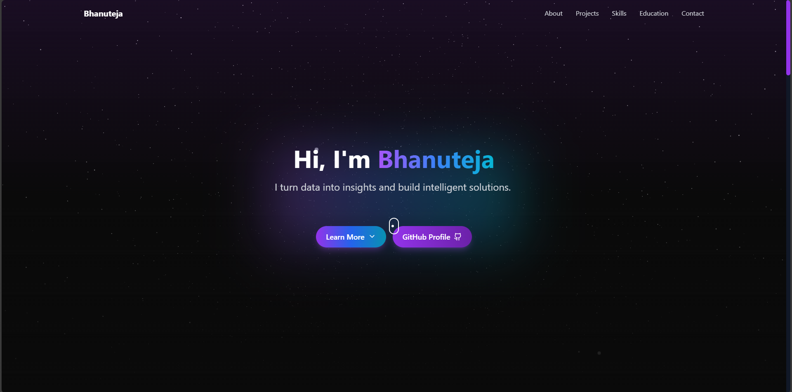

# Personal Portfolio Website

A modern, responsive portfolio website built with React, Vite, and Tailwind CSS, featuring interactive animations and a sleek design.

🌐 **Live Site**: [View Portfolio](https://portfolio-git-main-bhanu-tejas-projects-544289e2.vercel.app)



## 🚀 Features

- **Modern UI/UX**: Clean and professional design with smooth animations
- **Responsive Design**: Fully responsive across all devices
- **Interactive Elements**: 
  - Particle effects
  - 3D hover animations
  - Smooth scrolling
  - Typing animations
- **Performance Optimized**: Built with Vite for faster development and production builds
- **Sections Include**:
  - Hero Section with animated typing
  - About Me
  - Projects Showcase
  - Skills & Expertise
  - Education Timeline
  - Contact Information
  - Footer with Social Links

## 🛠️ Technologies Used

- **React** - Frontend framework
- **Vite** - Build tool and development server
- **Tailwind CSS** - Utility-first CSS framework
- **Framer Motion** - Animation library
- **Three.js** - 3D graphics
- **React Three Fiber** - React renderer for Three.js
- **Lucide React** - Icon library
- **React Type Animation** - Text typing effects
- **React Intersection Observer** - Scroll-based animations

## 🏃‍♂️ Running the Project

1. **Clone the repository**
   ```bash
   git clone https://github.com/bhanuteja-tech/Portfolio.git
   cd Portfolio
   ```

2. **Install dependencies**
   ```bash
   npm install
   ```

3. **Start the development server**
   ```bash
   npm run dev
   ```

4. **Build for production**
   ```bash
   npm run build
   npm run preview  # To preview the production build locally
   ```

## 📁 Project Structure

```
portfolio/
├── src/
│   ├── components/
│   │   ├── About.jsx
│   │   ├── Contact.jsx
│   │   ├── Education.jsx
│   │   ├── Footer.jsx
│   │   ├── Hero.jsx
│   │   ├── Navbar.jsx
│   │   ├── Projects.jsx
│   │   └── Skills.jsx
│   ├── utils/
│   │   └── particles.js
│   ├── App.jsx
│   └── main.jsx
├── public/
│   └── assets/
├── index.html
└── package.json
```

## 🚀 Deployment

This project is deployed on Vercel. To deploy your own version:

1. Fork this repository
2. Create a Vercel account
3. Import your forked repository
4. Vercel will automatically detect the settings and deploy

## 🎨 Customization

1. **Personal Information**: Update your personal details in the component files
2. **Color Scheme**: Modify the Tailwind configuration in `tailwind.config.js`
3. **Projects**: Edit the projects array in `src/components/Projects.jsx`
4. **Skills**: Update skills in `src/components/Skills.jsx`
5. **Education**: Modify education details in `src/components/Education.jsx`

## 🌟 Key Features Explained

- **Particle Effects**: Interactive background particles created using Three.js
- **Glass Morphism**: Modern glass-like UI elements with backdrop filters
- **Animated Sections**: Scroll-triggered animations using Framer Motion
- **Dynamic Typography**: Animated text using React Type Animation
- **Responsive Navigation**: Mobile-friendly navigation with smooth scrolling
- **Project Cards**: Interactive project cards with hover effects
- **Skills Showcase**: Categorized skills display with icons
- **Education Timeline**: Chronological display of educational background

## 📱 Responsive Design

The portfolio is fully responsive and optimized for:
- Desktop (1200px and above)
- Tablet (768px to 1199px)
- Mobile (320px to 767px)

## 🔧 Performance Optimization

- Lazy loading of images
- Code splitting
- Optimized asset delivery
- Efficient animation handling

## 📄 License

This project is licensed under the MIT License - see the [LICENSE](LICENSE) file for details.

## 👤 Author

**Bhanuteja**
- GitHub: [@bhanuteja-tech](https://github.com/bhanuteja-tech)
- LinkedIn: [bhanuteja12](https://www.linkedin.com/in/bhanuteja12/)
- Portfolio: [View Portfolio](https://portfolio-git-main-bhanu-tejas-projects-544289e2.vercel.app)

## 🙏 Acknowledgments

- Icons by [Lucide React](https://lucide.dev/)
- Animations powered by [Framer Motion](https://www.framer.com/motion/)
- 3D effects using [Three.js](https://threejs.org/)
